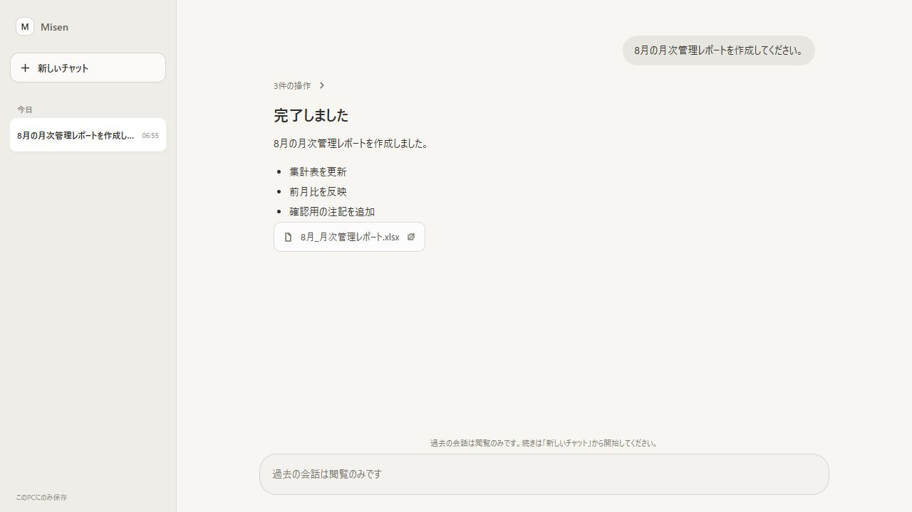
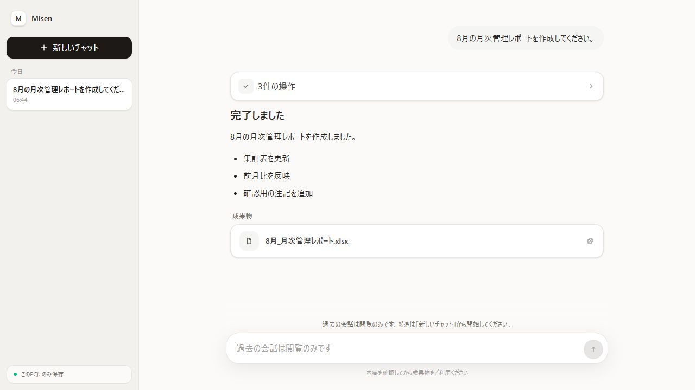

# Issue #105 第1PR: スタイル付き assistant-ui

同じ依頼「8月の月次管理レポートを作成してください。」をローカルの決定論的 runner に流し、Edge で 1440×900 の画面を描画した。

| 変更前 | 変更後 |
| --- | --- |
|  |  |

## 持たない方針

- [x] モデル選択がない
- [x] 設定画面がない
- [x] 生の推論・プロバイダー表示がない
- [x] 添付がない
- [x] 分岐がない
- [x] Assistant Cloud がない

## 受け入れ確認

- [x] Markdown の見出し・段落・箇条書きが描画される
- [x] Tool 呼び出しが完了後に折りたたみカードになる
- [x] `ThreadPrimitive.Viewport` の自動スクロールと「最新のメッセージへ移動」を維持した
- [x] 送信中は送信ボタンが停止ボタンに切り替わる
- [x] `node --test dist/test/web-ui.test.js`: 4/4 PASS
- [x] `npm run test:unit`: 89 PASS / 3 SKIP / 0 FAIL、実測 4.448 秒（30秒以内）
- [x] `npm run build:force`: PASS
- [x] `dist/web/assets/` は `client.js` と `client.css` の2ファイルだけ
- [x] `package.json` の `dependencies` は `origin/main` と同一。Tailwind/PostCSS はビルド時の `devDependencies` のみ

## 補足

`npm audit --omit=dev` は npm registry が HTTP 503 を返したため未確認。依存差分の比較では配布時の `dependencies` に変更はない。
