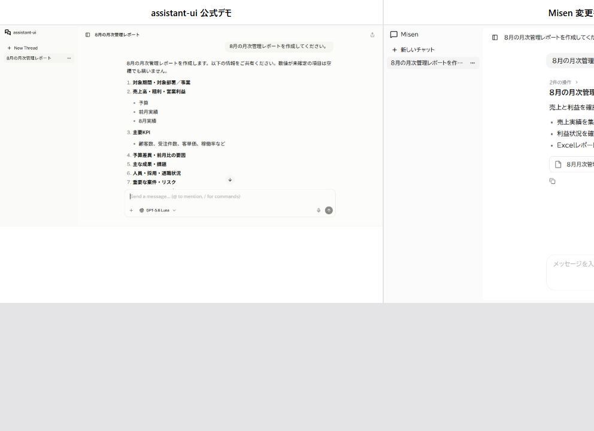

# Issue #105 第1PR: 公式 registry 版 assistant-ui

同じ依頼「8月の月次管理レポートを作成してください。」を assistant-ui Base 公式デモとローカルの決定論的 runner の両方へ送り、回答後のアプリ本体を同じビューポート幅で並べて確認した。公式サイトのナビゲーション部分は比較対象から除外した。

- 公式デモ単体: [official-demo.png](./official-demo.png)
- Misen 変更後単体: [pr1-registry-after.png](./pr1-registry-after.png)
- 従来画面: [pr1-before.png](./pr1-before.png)

## 公式方式への接続

- `components.json` に style-aware な `@assistant-ui` registry を設定した。
- shadcn/ui の基本コンポーネントと公式 `thread` / `thread-list` / `file` を registry から取得した。
- 成果物は独自カードではなく、External Store の `convertMessage` で標準 `file` part に投影し、公式 `File` renderer で表示する。
- ThreadList の公式 Delete primitive はローカル DELETE API に接続し、会話 JSON のみを削除する。`output/` の成果物は削除しない。
- Tailwind v4 と shadcn の zinc テーマ変数を `client.css` に集約した。旧自前 CSS は残していない。
- 利用者向け日本語のフォントは BIZ UDPゴシックを第一指定にした。
- Base 公式デモと同じ、薄い背景・8px の外周・白い角丸メイン面・48px のスレッドヘッダー・開閉可能なサイドバーというシェル構成にした。
- Base 公式デモでは非表示の ThreadList 検索欄は表示せず、公式と同じ新規会話と会話行だけの構成にした。
- registry の現行 ToolFallback は固定済み `@assistant-ui/react@0.15.17` より新しい approval API を参照するため、見た目と折りたたみ構造を維持したまま、PR1 で使う Tool 表示部分だけを互換化した。

## 持たない方針

- [x] モデル選択がない
- [x] 設定画面がない
- [x] 生の推論・プロバイダー表示がない
- [x] 持ち込み添付・マイクがない
- [x] BranchPicker・編集・再生成がない
- [x] Reasoning 表示がない
- [x] Assistant Cloud がない

## 受け入れ確認

- [x] 公式デモと同じアプリシェル、サイドバー幅、スレッドヘッダー、中央カラム、丸い Composer、メッセージ余白、アクションバー、ThreadList の視覚言語になった
- [x] Markdown の見出し・段落・箇条書きが公式 renderer で描画される
- [x] Tool 呼び出しが公式 ToolFallback / ToolGroup の折りたたみ構造で描画される
- [x] 成果物が標準 `file` part と公式 File renderer で表示される
- [x] `ThreadPrimitive.Viewport` の自動スクロールとスクロールボタンを維持した
- [x] 送信中は送信ボタンが停止ボタンに切り替わる
- [x] `npm run test:unit`: 91 PASS / 3 SKIP / 0 FAIL、最終実測 6.257 秒（ビルド 2.438 秒を含み30秒以内）
- [x] `npm run build:force`: PASS、実測 2.318 秒
- [x] `dist/web/assets/` は `client.js` と `client.css` の2ファイルだけ
- [x] `package.json` の production `dependencies` は `origin/main` と同一。UI/Tailwind 関係はビルド時の `devDependencies` のみ
- [x] ThreadStore の reducer と SSE イベント契約は変更していない
- [x] 会話削除後も `output/` の成果物が残り、再削除は 404、削除済み成果物の旧 download ID は無効になる
- [x] 実行中の会話削除は 409 で拒否され、会話データが残る
- [x] 実ブラウザーで同一依頼、Tool 折りたたみ、Markdown、標準 File 表示を確認した
- [x] 実ブラウザーで `document.fonts.check('16px "BIZ UDPGothic"')` が true になることを確認した

## 未確認

- ダーククラス用テーマ変数と variant は実装済みだが、今回の比較画像はライトテーマのみ。
