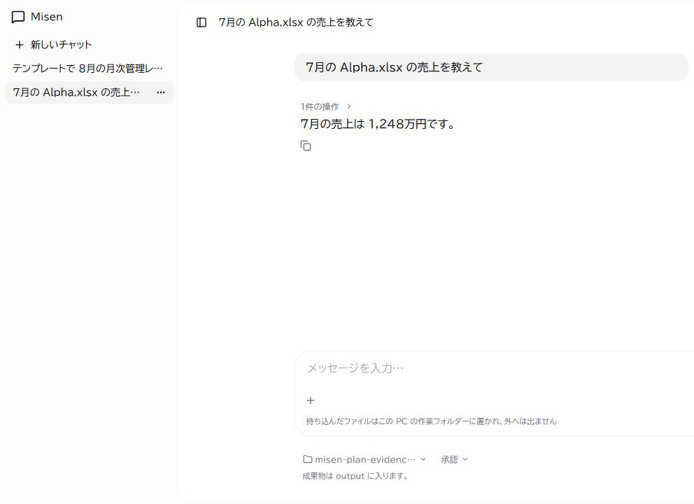
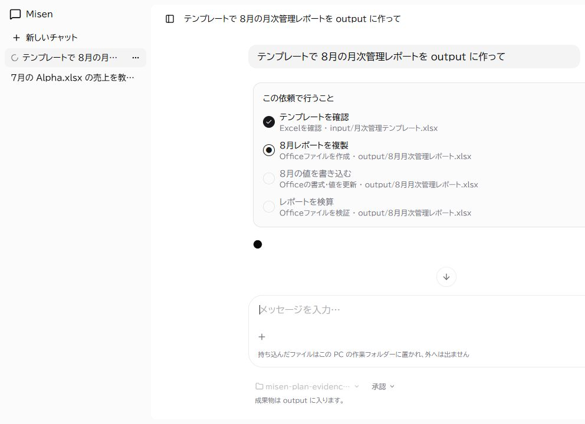

# Issue #105 依頼由来の実行計画

## 単一の読み取り

「7月の Alpha.xlsx の売上を教えて」は計画パネルを表示せず、操作 1 件と回答だけを表示する。



## 複数手順の進行

「テンプレートで 8月の月次管理レポートを output に作って」は、モデルが返した Tool・対象付きの具体的な手順を表示する。画面はテンプレート確認が完了し、レポート複製が進行中の状態。



## 計画と実行の差分監査

計画外の `office_get` と、計画にあったものの実行されなかった `office_set` / `office_inspect` は、内容を持たないメタデータとして次のように残る。

```jsonl
{"schema":"misen-audit/1","event":"plan.unplanned_tool","planId":"plan-report-write","tool":"office_get","target":"input/template.xlsx"}
{"schema":"misen-audit/1","event":"plan.unexecuted_step","planId":"plan-report-write","stepId":"step-3","tool":"office_set","target":"output/8月月次管理レポート.xlsx"}
{"schema":"misen-audit/1","event":"plan.unexecuted_step","planId":"plan-report-write","stepId":"step-4","tool":"office_inspect","target":"output/8月月次管理レポート.xlsx"}
```

画面は実ブラウザーで、外部モデルを呼ばない決定的なローカル runner / plan provider を注入して撮影した。計画生成・実行差分は unit test で同じ契約を検証する。
